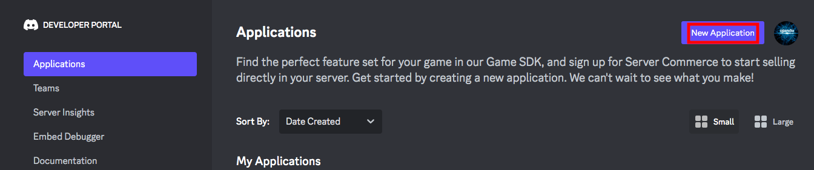
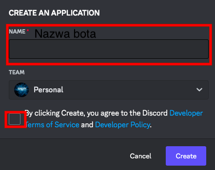
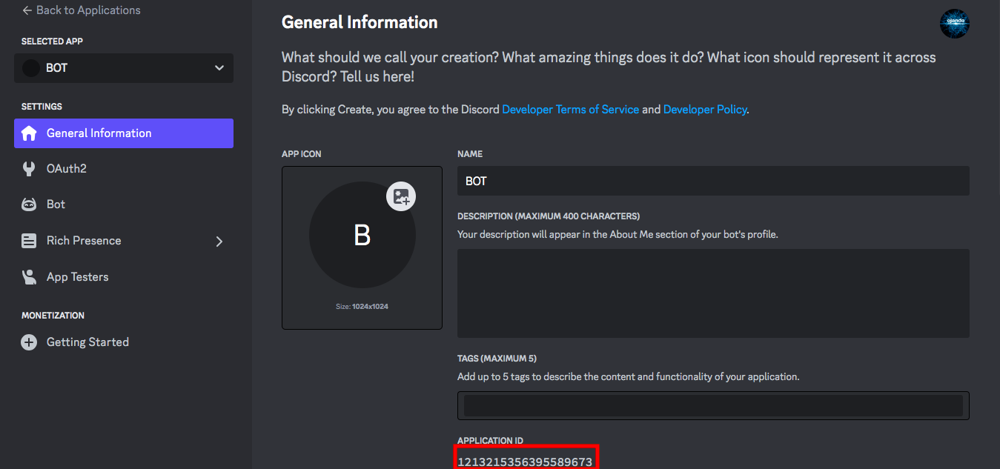
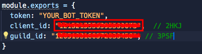
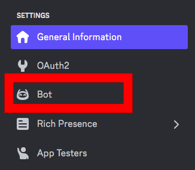
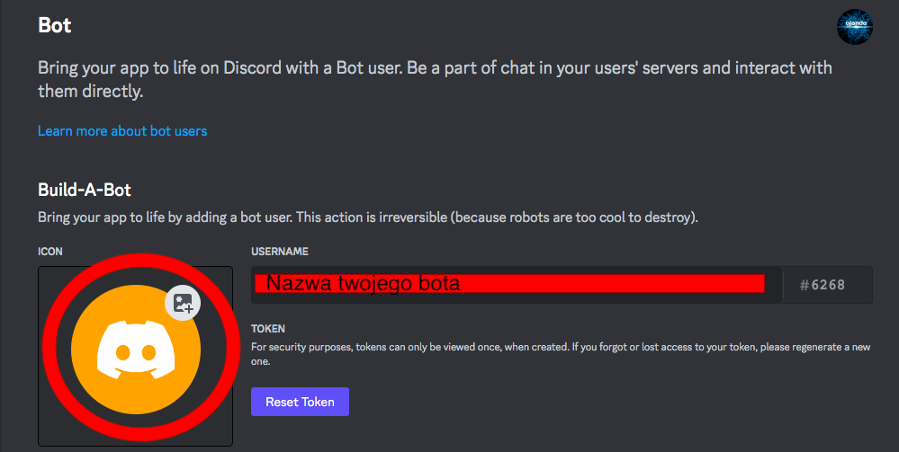
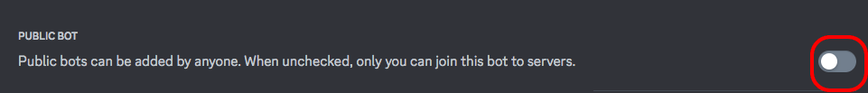
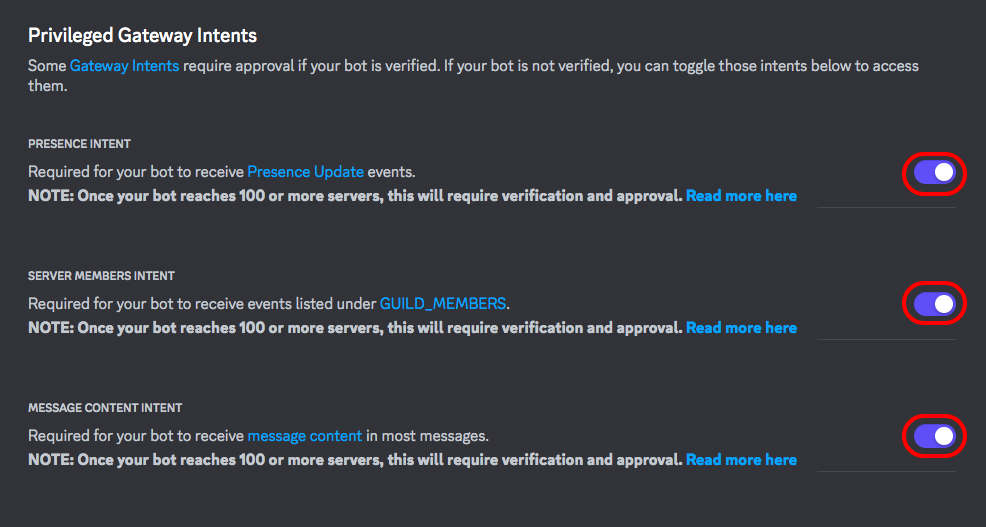
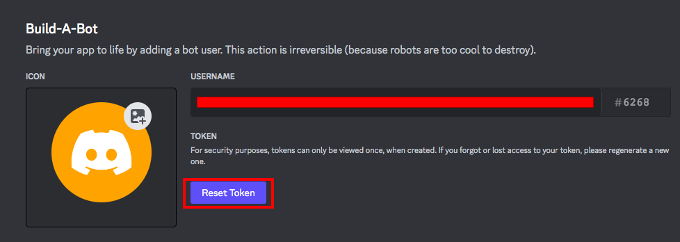
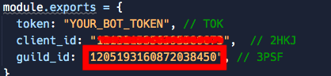

# 1
### Wejdź na strone https://discord.com/developers/applications
# 2
### Kliknij przycisk New Application 
# 3
### Nazwij swojego bota, zaznacz i kliknij Create 
# 4
### W pliku config.js w client id (2HKJ) podaj application id i w prefix podaj prefix bota, kliknij <a href="https://bit.ly/db-add-tmplt" target="_blank">tutaj</a> i w linku znajdź "PODAJ_TU_APPLICATION_ID" i zamień to na application id)  
# 5
### Wejdź w sekcje bot 
# 6
### Ustaw avatar i nazwe profilu bota 
# 7
### Jeżeli chcesz aby nikt twojego bota nie mógł dodać odznacz tą opcje (domyślnie jest zaznaczona) 
# 8
### Zjedź niżej i zaznacz te trzy opcje 
# 9
### Kliknij Reset Token wejdź w plik config.js w token (TOK) podaj to co ci się wyświetliło 
# 10
### Potem w ustawieniach włącz tryb dewelopera, kliknij ppm (prawym przyciskiem myszy na serwer) na serer i kliknij kopiuj id serwera i w config.js i wklej to w guild_id (3PSF) 
